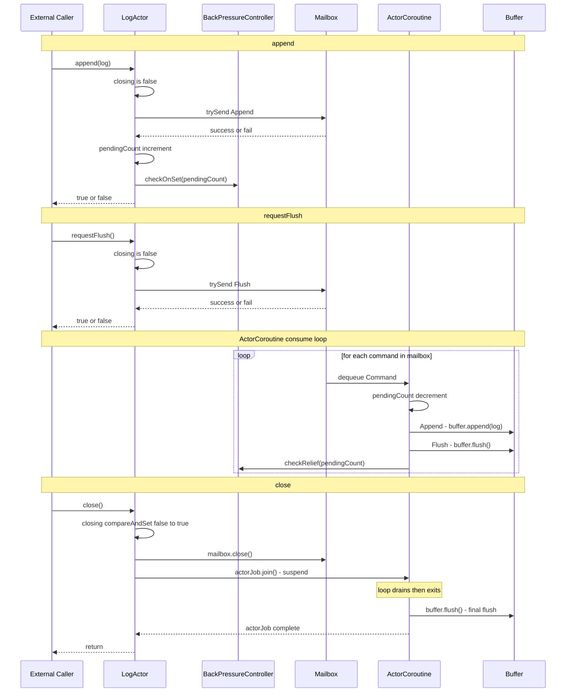

## Flow Diagram

## Components
| Component              | Description                                                                                              |
|------------------------|----------------------------------------------------------------------------------------------------------|
| LogActor               | 외부 호출자와 ActorCoroutine 사이의 인터페이스 역할을 하는 클래스.   `append()`, `requestFlush()`, `close()` 메서드 제공.        |
| Mailbox                | 명령 큐로 Channel 로 구현됨. `append()` 와 `requestFlush()`에서 trySend로 명령을 추가.   ActorCoroutine이 이 큐에서 명령을 소비. |
| ActorCoroutine         | Mailbox에서 명령을 dequeue 하여 실행함.                                                                            |
| Buffer                 | Append 명령으로 받은 로그를 일시적으로 저장. 일정량이 쌓이거나 Flush 명령이 오면 생성자에서 주입받은 onFlush 콜백으로 전달 후 초기화.                 |
| BackPressureController | LogActor 내부 컴포넌트. pendingCount 기반으로 onset(80%)/relief(20%) 임계값을 관리.   외부에서는 `isBackPressured()` 로 폴링. |

## 메소드 해석

| 흐름             | 핵심                                                                             |
|----------------|--------------------------------------------------------------------------------|
| append()       | trySend 실패 시 즉시 false 반환 — non-blocking                                        |
| requestFlush() | Mailbox 순서를 지키므로 앞선 Append 들이 모두 처리된 후 실행                                      |
| ActorCoroutine | 단 하나의 코루틴만 Mailbox 를 소비 → **Buffer 동기화 불필요**                                   |
| Backpressure   | append()에서 onset, 각 command 처리 후 relief 체크. 외부에서는 `isBackPressured()` 로 폴링    |
| close()        | compareAndSet으로 단 한번만 닫히고, actorJob.join()으로 모든 호출자가 대기                        |
| final flush    | Mailbox 가 닫힌 후 루프 탈출 → 잔여 Buffer 를 마지막으로 flush                                |

## Q & A
#### requestFlush() 의 success / fail 은 어떻게 결정되나?
`requestFlush()` 메서드에서 MailBox에 `Flush` 명령을 추가할 때 `trySend` 메서드를 사용합니다. \
`trySend`는 명령이 성공적으로 큐에 추가되면 `true`를 반환하고, 큐가 닫혔거나 가득 찼을 때는 `false`를 반환합니다. 

`Channel.trySend()` 는 다음 2가지 상황에서 실패합니다.
1. 채널이 닫힌뒤 호출 시도
2. 채널이 가득찬 상태

그 외에는 성공합니다.

