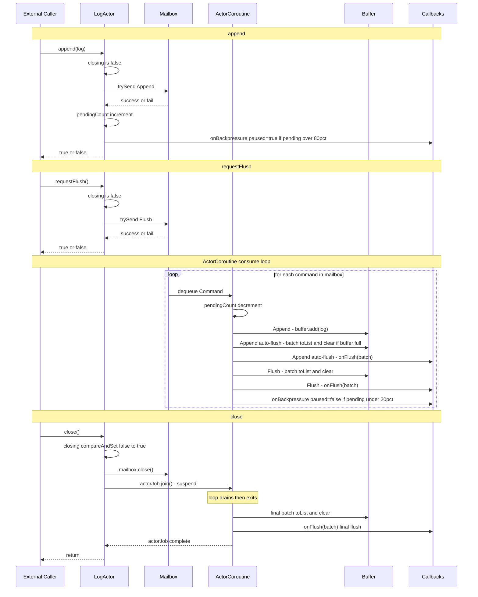

## 주요 포인트 요약

| 흐름             | 핵심                                                      |
|----------------|---------------------------------------------------------|
| append()       | trySend 실패 시 즉시 false 반환 — non-blocking                 |
| requestFlush() | Mailbox 순서를 지키므로 앞선 Append 들이 모두 처리된 후 실행               |
| ActorCoroutine | 단 하나의 코루틴만 Mailbox 를 소비 → Buffer 동기화 불필요                |
| Backpressure   | append()에서 onset, 각 command 처리 후 relief 체크              |
| close()        | compareAndSet으로 단 한번만 닫히고, actorJob.join()으로 모든 호출자가 대기 |
| final flush    | Mailbox 가 닫힌 후 루프 탈출 → 잔여 Buffer 를 마지막으로 flush          | 
