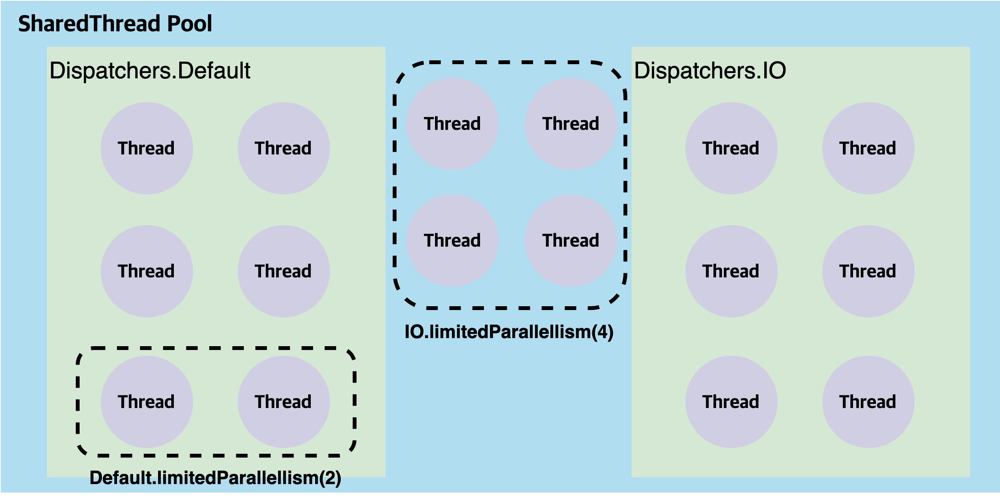
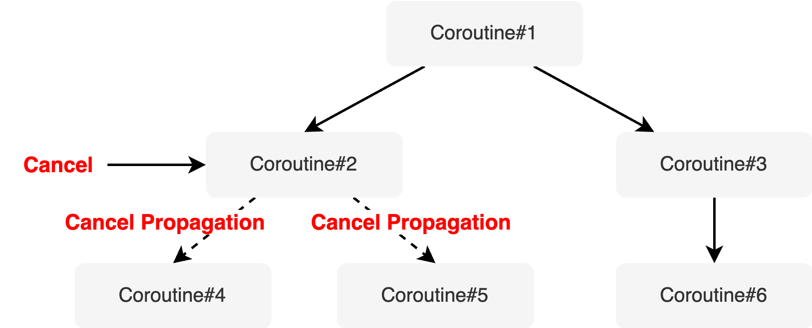
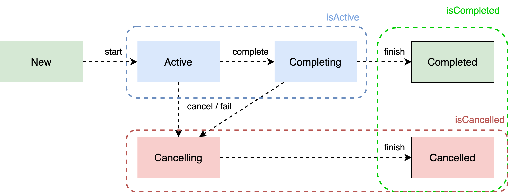
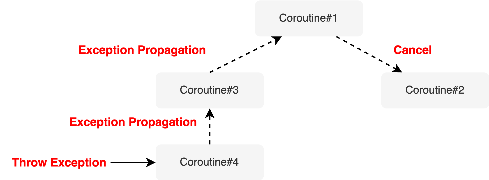
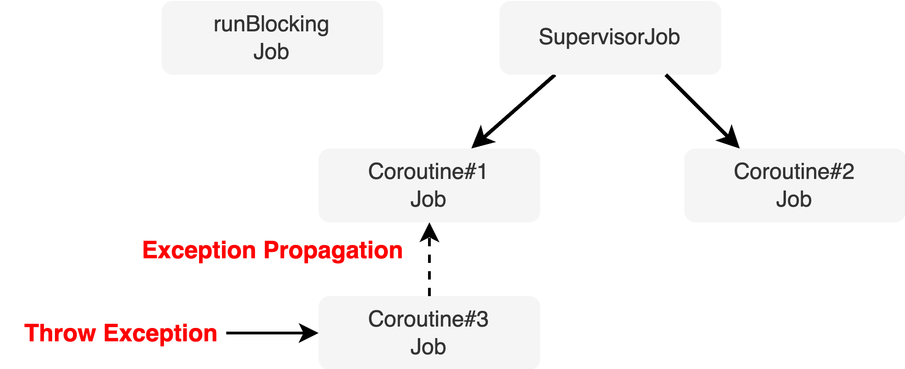
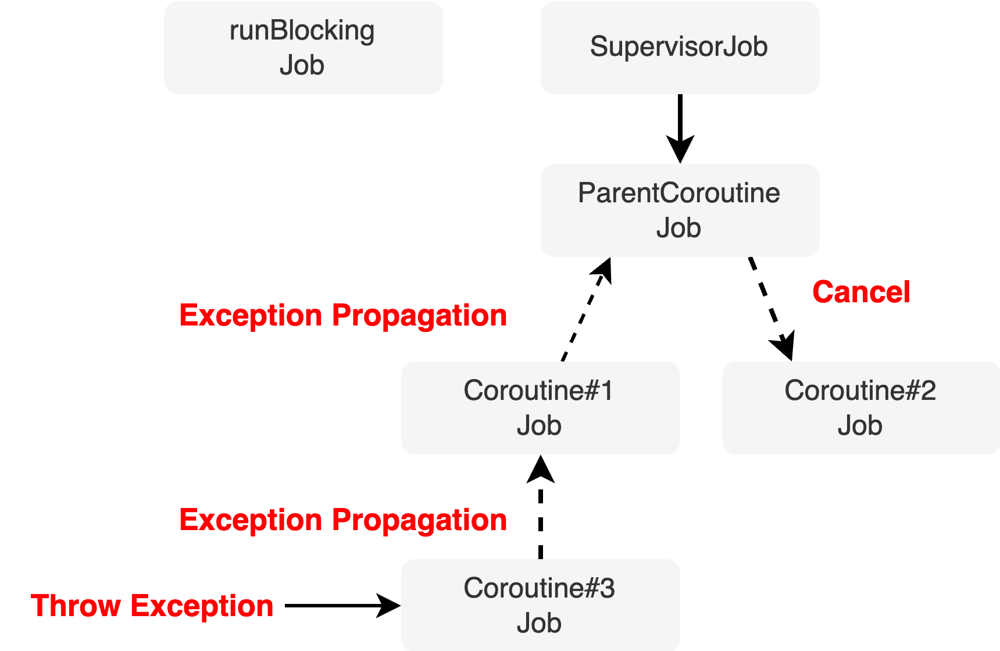
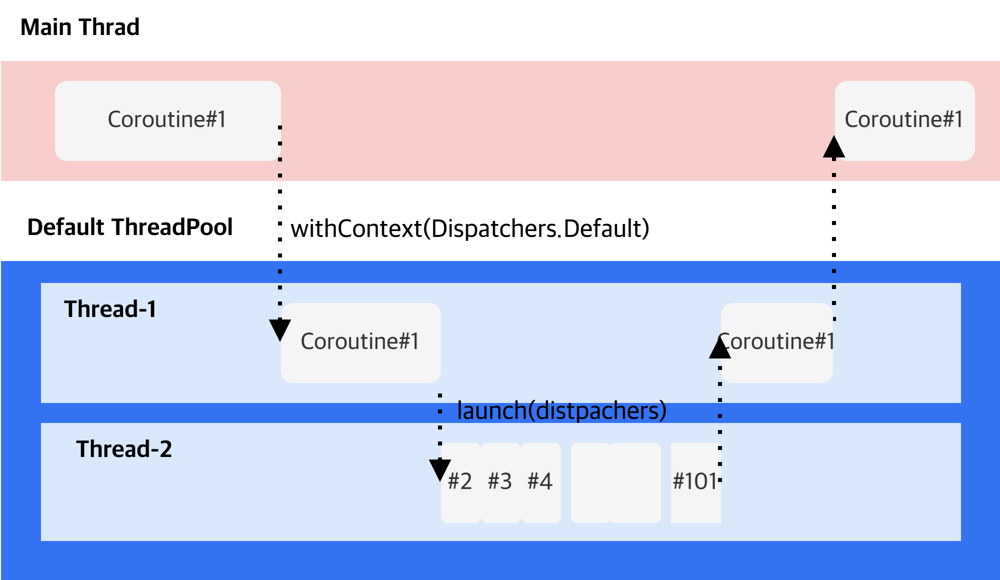

## (0) 코루틴이란
경량 스레드로 작업의 단위다. \
코루틴은 중단/재개가 가능하다. 코루틴 중단시 스레드는 블로킹되지 않고 다른 코루틴을 실행할 수 있다. \
코루틴은 비동기 프로그래밍을 쉽게 만들어준다. 


`runBlocking` 함수는 함수를 호출한 스레드를 사용하여 실행되는 코루틴을 만들어낸다. \
실행 완료시까지 다른 코루틴에 의해 스레드가 점유되지 않도록 블로킹한다. 

예를들어, main 스레드에서 `runBlocking`을 호출하면 main 스레드가 코루틴이 완료될 때까지 블로킹된다. \
runBlocking 인자로 들어온 람다식을 실행하며, 람다식 내부의 모든 코드 실행 완료까지 코루틴을 종료하지 않는다.

```kotlin
fun main() = runBlocking {
  println("Hello, Coroutine!")
}
```

## (1) CoroutineDispatcher
CoroutineDispatcher 는 코루틴을 스레드 또는 스레드 풀에 보내는 역할을 한다.


#### 예제
```kotlin
  @DisplayName("Multi thread dispatcher")
  @Test
  fun multiThreadsDispatcher(): Unit = runBlocking { // coroutine#1
    val dispatcher : CoroutineDispatcher = newFixedThreadPoolContext(
      nThreads = 2,
      name = "MultiThread"
    )

    launch(context = dispatcher) { // coroutine#2
      println("Running in thread: ${Thread.currentThread().name}")
    }

    launch(context = dispatcher) { // coroutine#3
      println("Running in thread: ${Thread.currentThread().name}")
    }
  }
```

실행 결과
```txt
Running in thread: MultiThread-1 @coroutine#2
Running in thread: MultiThread-1 @coroutine#3
```

#### 미리 정의된 CoroutineDispatcher

`newFixedThreadPoolContext` 함수로 객체를 만드는 것은 비효율적일 가능성이 높다. \
특정 CoroutineDispatcher 객체에서만 사용되는 스레드풀이 생성되기 때문에, 스레드 재사용성이 떨어진다. \
예를 들어 여러 개발자가 함께 개발할 경우 특정 용도를 위해 만들어진 CoroutineDispatcher 객체가 이미 메모리상 있음에도 \
해당 객체 존재를 몰라 다시 새로운 CoroutineDispatcher 객체를 만들며 스레드 생성 비용이 들게된다.

따라서 코틀린 라이브러리는 미리 정의된 CoroutineDispatcher 객체를 제공한다. 

- Dispachers.Default : CPU 집약적인 작업에 적합하다. (예: 복잡한 계산, 데이터 처리 등)
- Dispachers.IO : 입출력 작업에 적합하다. (예: 파일 읽기/쓰기, 네트워크 통신 등)
- Dispachers.Main : 메인 스레드를 사용하기 위한 디스패처다.

Dispatchers.Default 와 Dispatchers.IO 모두 싱글톤 인스턴스다.
또 둘다 코틀린 라이브러리에서 구현한 공유된 쓰레드풀을 사용한다. \
Dispatchers.Default 로 모든 스레드를 사용하면 해당 시간동안 다른 연산이 실행되지 못한다. \
이를 방지하기 위해 코루틴 라이브러리에서 Dispatchers.Default 일부 스레드만 사용해 특정 연산을 실행할 수 있게하는 `limitedParallelism` 함수를 제공한다. 



`Default.limitedParallelism` 은 Default 스레드풀 내의 스레드를 사용한다. \
`IO.limitedParallelism` 은 공유 스레드풀 내에서 Default, IO 쓰레드풀과 격리된 새로운 스레드 풀을 새로 생성한다.
특정 작업이 다른 작업에 영향받지 않아야할 때 사용한다.

## (2) Job
코루틴을 생성하는 `runBlocking`, `launch` 함수를 코루틴 빌더라고 부른다.
코루틴 빌더 함수는 코루틴을 추상화한 Job 객체를 생성한다.

코루틴은 중단/재개가 가능한 작업의 단위라고 했다. \ 
Job 객체를 통해 코루틴의 상태 관리를 할 수 있다.

#### join() 순차대기
```kotlin
fun joinTest() = runBlocking {
  val updateTokenJob = launch(Dispatchers.IO) {
    println("${Thread.currentThread().name} 토큰 업데이트 시작")
    delay(1000L)
    println("${Thread.currentThread().name} 토큰 업데이트 완료")
  }
  updateTokenJob.join()
  val networkCallJob = launch(Dispatchers.IO) {
    println("${Thread.currentThread().name} 네트워크 요청")
  }
}
```

토큰 업데이트 코루틴잡이 종료되고 나서야 네트워크 요청 코루틴이 작동한다.\
순차 처리가 필요할 때는 `join()` 메소드를 사용할 수 있다. \
`join()` 호출시 대상 코루틴의 작업이 완료될 때까지 `join()` 을 호출한 코루틴이 일시 중단된다.

즉, 위에선 `runBlocking{}` 의 coroutine#1 이 updateTokenJob 의 coroutine#2 가 완료될 때까지 일시 중단된다.

#### joinAll() 복수 순차대기
여러개의 Job 이 완료되고 나서야 실행되어야 한다면 `joinAll()` API 를 활용해보자.

```kotlin
fun waitAllJobs() = runBlocking {
  val convertImageJob1 = launch(Dispatchers.Default) {
    delay(1000L)
    println("${Thread.currentThread().name} 이미지 1 변환 완료")
  }
  val convertImageJob2 = launch(Dispatchers.Default) {
    delay(1000L)
    println("${Thread.currentThread().name} 이미지 2 변환 완료")
  }

  joinAll(convertImageJob1, convertImageJob2)
  val uploadImages = launch(Dispatchers.IO) {
    println("${Thread.currentThread().name} 이미지 1,2 업로드 완료")
  }
}
```

#### cancel() 작업 취소

```kotlin
fun cancelTest() = runBlocking {
  val startTime = System.currentTimeMillis()
  val longJob = launch(Dispatchers.IO) {
    repeat(5) { idx->
      delay(1000L)
      println("${getElapsedTime(startTime)} current index: $idx")
    }
  }
  delay(2500L) 
  longJob.cancel() // 작업 취소
}
```
실행 결과 0,1 만 출력되고 2,3,4 는 취소되어 실행되지 않는다.
```txt
[Elapsed time: 1010 ms] current index: 0
[Elapsed time: 2013 ms] current index: 1
```
#### cancelAndJoin() 
cancel() API 는 비동기적으로 동작한다. \
즉, **cancel 대상이 완전히 작업이 취소되길 기다리지 않는다.**

아래와 같은 절차로 동작한다.
1. cancel() 호출
2. cancel flag 활성화로 "취소 요청됨" 상태로 전이
3. 일시 중단 시점 또는 코루틴 실행 대기 시점에 cancel flag 확인
4. cancel flag `true` 면 취소

따라서, `cancel()` 호출 직후 다른 코루틴이 실행될때, 순서가 보장되지 않는다. \
**완벽히 대상 코루틴이 '취소됨'을 보장하고 싶을 때 `cancelAndJoin()` 을 사용한다.**

## (3) async/await


## (4) CoroutineContext
CoroutineContext 는 코루틴의 동작 방식을 정의하는 요소들의 집합이다. \
CoroutineContext 는 여러 요소(Element)로 구성되며, 각 요소는 코루틴의 특정 속성이나 동작 방식을 정의한다.

실질적으로 쓰이는 요소는 다음 4가지다.
1. CoroutineName: 코루틴의 이름 설정
2. CoroutineDispatcher: 코루틴을 스레드에 할당하여 실행
3. Job: 코루틴의 추상체로 코루틴 조작 지원
4. CoroutineExceptionHandler: 코루틴에서 발생한 예외 처리

#### CoroutineContext 생성
`+` 연산자로 여러 요소를 조합하여 CoroutineContext 를 생성할 수 있다.
```kotlin
val coroutineContext: CoroutineContext = Dispatchers.IO + CoroutineName("MyCoroutine")
```

#### CoroutineContext 접근
`[]` 연산자를 사용하여 특정 요소에 접근할 수 있다.
```kotlin
coroutineContext[CoroutineName]
```

#### CoroutineContext 조합
둘 이상의 CoroutineContext 를 합칠 경우 나중에 온 요소가 기존 요소를 덮어쓴다.
```kotlin
  fun overwriteTest() {
    // given
    val coroutineContext = CoroutineName("MyCoroutine")
    val newCoroutineContext = coroutineContext + CoroutineName("NewCoroutine")
    // when then
    assertThat(coroutineContext[CoroutineName]).isEqualTo(CoroutineName("MyCoroutine"))
    assertThat(newCoroutineContext[CoroutineName]).isEqualTo(CoroutineName("NewCoroutine"))
  }
```

#### CoroutineContext 요소 제거
`minusKey` 연산자를 사용하여 특정 요소를 제거할 수 있다.

```kotlin
val coroutineName = CoroutineName("MyCoroutine")
val myJob = Job()
val context = coroutineName + myJob
val newContext = context.minusKey(Job)
```


## (5) 구조화된 동시성
구조화된 동시성(Structured Concurrency) 원칙은 비동기 작업을 구조화하여 비동기 코드를 보다 안정적이고 예측하게 만드는 원칙이다. \
코루틴은 부모-자식 관계로 구조화한다. 

코루틴 빌더함수 내에서 빌더함수를 호출하면 부모 - 자식 관계가 형성된다. 
```kotlin
runBlocking {
  // 부모 코루틴
  luanch {
    // 자식 코루틴
  }
}
```

구조화된 코루틴은 여러 특징을 갖는데 대표적인 특징은 다음과 같다.

- 부모 코루틴의 실행 환경이 자식 코루틴에게 상속된다.
- 부모 코루틴이 취소되면 자식도 취소된다.
- 부모 코루틴은 자식 코루틴이 완료될 때까지 대기한다.
- `CoroutineScope`을 사용해 코루틴 실행 범위를 제한할 수 있다.

#### CoroutineContext 상속
```kotlin
  fun parentChildSameContext(): Unit = runBlocking {
    val coroutineContext = newSingleThreadContext("MyThread") + CoroutineName("MyCoroutine")
    launch(coroutineContext) {
      assertThat(Thread.currentThread().name).contains("MyThread")
      launch {
        assertThat(Thread.currentThread().name).contains("MyThread")
      }
    }
  }
```
`MyThread` 스레드에서 부모 코루틴이 실행되고, 자식 코루틴도 동일한 스레드에서 실행된다. 

여러 요소 중 `Job` 만큼은 그대로 상속되지 않는다. \
대신, 부모 자식 관계를 생성한다.

```kotlin
  fun parentChildPropertiesTest(): Unit = runBlocking {
    val parentJob = coroutineContext[Job]
    launch {
      val childJob = coroutineContext[Job]
      assertThat(childJob).isNotEqualTo(parentJob)
      assertThat(childJob!!.parent).isSameAs(parentJob)
      assertThat(parentJob!!.children.contains(childJob)).isTrue
    }
  }
```

#### Cancel Propagation
부모 코루틴 (Job)을 취소하면 자식 코루틴도 모두 취소가 전파된다.


Job 뿐만 아니라 CoroutineScope 도 `cancel()` API 를 제공한다.

```kotlin
  fun coroutineCancellationTest(): Unit = runBlocking {
    launch(CoroutineName("ParentCoroutine")) {
      launch(CoroutineName("ChildCoroutine1")) {
        delay(100L)
        println("${Thread.currentThread().name} 실행")
      }
      launch(CoroutineName("ChildCoroutine2")) {
        delay(100L)
        println("${Thread.currentThread().name} 실행")
      }
      this.cancel()
    }

    launch(CoroutineName("ParentCoroutine2")) {
      delay(100L)
      println("${Thread.currentThread().name} 실행")
    }
  }
```

실행 결과
```text
main @ParentCoroutine2#3 실행
```

ParentCoroutine, ChildCoroutine1,2 는 모두 취소되었다.

`CoroutineScope.cancel` 을 살펴보자
```kotlin
fun CoroutineScope.cancel(cause: CancellationException? = null) {
    val job = coroutineContext[Job] ?: error("Scope cannot be cancelled because it does not have a job: $this")
    job.cancel(cause)
}
```

CoroutineScope 객체에 cancel 함수 호출시 CoroutineScope 객체는 자신의 `coroutineContext` 프로퍼티를 통해 \
Job 객체에 접근하여 `cancel()` 함수를 호출한다.

## (6) CoroutineScope
CoroutineScope 객체는 자신의 범위 내 생성된 코루틴에게 실행 환경을 제공하고, 실행 범위를 관리하는 역할을 한다.
```kotlin
interface CoroutineScope {
  val coroutineContext: CoroutineContext
}
```

## (7) runBlocking vs launch
`runBlocking` 함수는 코루틴을 실행시키고 해당 코루틴을 호출한 스레드를 차단한다. \ 
`runBlocking {}` 내에서 부모/자식 코루틴만 실행 가능한 상태가 된다.

```kotlin
  fun runBlockingTest() = runBlocking {
    val startTime = System.currentTimeMillis()
    runBlocking {
      delay(1000L)
      println("${Timer.getElapsedTime(startTime)}, ${Thread.currentThread().name} 하위 코루틴 종료") // 1
    }
    println("${Thread.currentThread().name} 실행 완료") // 2
  }
```

실행 결과
```text
[Elapsed time: 1012 ms], main @coroutine#2 하위 코루틴 종료
main @coroutine#1 실행 완료
```

`launch` 함수도 코루틴을 실행시키지만 해당 코루틴을 호출한 스레드를 차단하지 않는다.
```kotlin
  fun launchTest() = runBlocking {
    val startTime = System.currentTimeMillis()
    launch {
      delay(1000L)
      println("${Timer.getElapsedTime(startTime)}, ${Thread.currentThread().name} 하위 코루틴 종료") // 2
    }
    println("${Thread.currentThread().name} 실행 완료") // 1
  }
```

실행 결과 
```text
main @coroutine#1 실행 완료
[Elapsed time: 1006 ms], main @coroutine#2 하위 코루틴 종료
```

## (8) Job 상태


- New: 코루틴이 생성된 상태
- Active: 코루틴 실행중 상태 또는 실행 대기 상태 (쓰레드 상태 `Runnable` 과 유사)
- Completing: 부모 코루틴 실행이 완료되고 자식 코루틴의 완료를 기다리는 상태.
- Cancelling: 취소중 상태
- Cancelled: 취소가 완료된 상태

Job, Deferred 모두 상태를 체크할 수 있는 메소드 `isActive`, `isCompleted`, `isCancelled` 가 제공된다.


## (9) 예외 처리
코루틴은 주로 입출력 IO 작업에 자주 사용되므로 예측할 수 없는 예외상황이 잦다.
코루틴이 예외를 전파하는 방식과 이를 제한하고 처리하는 방법을 알아보자.


#### 자식의 예외는 부모로 전파된다.
코루틴 예외 발생시 해당 코루틴은 취소되며 부모로 예외가 전파된다. \
부모 또한 별도 예외처리 로직이 없는한, 코루틴이 취소되며 취소는 자식으로 전파된다.
```kotlin
fun exceptionTest() = runBlocking{
  launch(CoroutineName("Coroutine1")) {
    launch(CoroutineName("Coroutine3")) {
      throw RuntimeException("Exception")
    }
    delay(100L)
    println("${Thread.currentThread().name} 실행")
  }

  launch(CoroutineName("Coroutine2")) {
    delay(100L)
    println("${Thread.currentThread().name} 실행")
  }

  delay(1000L)
}
```

실행 결과
```text
java.lang.RuntimeException: Exception
```



#### (1) SupervisorJob 예외 전파 제한
`SupervisorJob` 이라는 객체를 사용하면 부모가 자식으로부터 예외를 전달받아도 더 이상 예외를 전파하지 않는다.



```kotlin
fun supervisorJobTest() = runBlocking {
  val supervisorJob = SupervisorJob()
  launch(CoroutineName("Coroutine1") + supervisorJob) {
    launch(CoroutineName("Coroutine3")) {
      throw RuntimeException("Exception")
    }

    delay(100L)
    println("${Thread.currentThread().name} 실행")
  }
  launch(CoroutineName("Coroutine2") + supervisorJob) {
    delay(100L)
    println("${Thread.currentThread().name} 실행")
  }
  
  delay(400L)
}
```

#### (2) CoroutineScope + SupervisorJob 예외 전파 제한
```kotlin
fun coroutineScopeSupervisorJob() = runBLocking {
  val coroutineScope = CoroutineScope(SupervisorJob())
  coroutineScope.apply {
    launch(CoroutineName("Coroutine1")) {
      launch(CoroutineName("Coroutine3")) {
        throw RuntimException("예외 발생")
      }
      
      delay(100L)
    }
    
    launch(CoroutineName("Coroutine2")) {
      delay(100L)
      println("${Thread.currentThread().name} 실행")
    }
  }
}
```

Coroutine3 에서 발생한 예외가 1까지는 전파되지만 그 상위인 SupervisorJob 까지는 전파되지 않는다. \
따라서 Coroutine2 는 정상 실행된다.
```text
Coroutine2#4 실행
```

#### (3) ✅ SupervisorScope 예외 전파 제한
supervisorScope 을 사용하면 아주 간결한 문법으로 다음 효과를 얻는다.
- SupervisorJob 을 가진 CoroutineScope 객체를 생성한다.
- supervisorScope 함수로 생성한 SupervisorJob 객체는 supervisorScope 함수를 호출한 코루틴을 부모로 갖는다.
- supervisorScope 함수로 생성한 SupervisorJob 객체는 자식 코루틴 완료시 자동 완료된다.

-> 복잡한 설정 없이 Job Hierarchy 를 유지하고 예외 전파를 제한할 수 있다.


```kotlin
  fun supervisorScopeTest(): Unit = runBlocking {
    supervisorScope {
      launch(CoroutineName("Coroutine1")) {
        launch(CoroutineName("Coroutine3")) {
          throw RuntimeException("Exception")
        }

        delay(100L)
        println("${Thread.currentThread().name} 실행")
      }

      launch(CoroutineName("Coroutine2")) {
        delay(100L)
        println("${Thread.currentThread().name} 실행")
      }
    }
  }
```


> Spring / Ktor 에서 supervisorScope 을 기본으로 사용한다.

#### (4) 흔히 하는 실수

> ⚠️ `launch()` 함수 인자에 Job 객체를 입력할 경우 해당 Job 객체를 부모로하는 새로운 Job 객체를 만든다.

```kotlin
  fun misLeadingSupervisorJobTest() = runBlocking {
    launch(CoroutineName("Parent Coroutine") + SupervisorJob()) {
      launch(CoroutineName("Coroutine1")) {
        launch(CoroutineName("Coroutine3")) {
          throw RuntimeException("Exception")
        }

        delay(100L)
        println("${Thread.currentThread().name} 실행")
      }

      launch(CoroutineName("Coroutine2")) {
        delay(100L)
        println("${Thread.currentThread().name} 실행")
      }
    }
    delay(400L)
  }
```



SupervisorJob 을 부모로 하는 Job 을 새로 생성한다. 
SupervisorJob -> ParentCoroutine Job-> Coroutine1 Job -> Coroutine3 Job 이된다.
따라서 Coroutine3 의 에러가 ParentCoroutine 까지 전파된다.

#### async 또한 catch 로 감싸지 않으면 부모로 예외가 전파된다.
```kotlin
  fun notAwaitExceptionPropagationTest(): Unit = runBlocking {
    // should catch this since exception is to be propagated.
    val deferred = async(CoroutineName("Coroutine1")) {
      throw RuntimeException("Exception in coroutine1")
    }

    launch(CoroutineName("Coroutine2")) {
      delay(100L) 
      println("Coroutine2 is executed") 
    }
  }
```

실행 결과
```txt
java.lang.RuntimeException: Exception in coroutine1
```

Coroutine1에 대한 `await()`을 호출하지 않아도 exception 이 부모 코루틴으로 전파되기 때문에, \
Coroutine2 또한 실행되지 않는다.

#### 개선버전: `supervisorScope` 적용
```kotlin
  fun supervisorScopeTest(): Unit = runBlocking {
    supervisorScope {
      val deferred = async(CoroutineName("Coroutine1")) {
        throw RuntimeException("Exception in coroutine1")
      }

      val result = withContext(CoroutineName("Coroutine2")) {
        delay(100L)
        return@withContext 5
      }

      assertThat(result).isEqualTo(5)
    }
  }
```
`Coroutine1` 의 예외가 supervisorScope 에 전파되지 않는다. \
`Coroutine2` 가 정상실행된다.

### CoroutineExceptionHandler

예외를 로깅하거나, 오류 메시지를 표시하기 위해 구조화된 코루틴들에 공통적으로 예외처리기를 설정할 때 사용한다.

```kotlin
  fun commonLoggingTest() = runBlocking {
    val exceptionHandler = CoroutineExceptionHandler { coroutineContext, exception ->
      println("Coroutine ${coroutineContext[CoroutineName]} ${exception.message}")
    }

    CoroutineScope(Dispatchers.IO)
      .launch(CoroutineName("Coroutine1") + exceptionHandler) {
        // the exception handling is done in the coroutine 1
        launch(CoroutineName("Coroutine2")) {
          throw Exception("Coroutine2 Exception")
        }
      }

    delay(50L)
  }
```

`CoroutineExceptionHandler` 는 처리되지 않은 예외가 `launch` 로 시작된 코루틴 트리의 최상위에 도달했을 때 호출된다.\
즉, `launch` 로 생성된 루트 부모코루틴에서 `CoroutineExceptionHandler` 가 작동한다.

```kotlin
  fun handleCoroutineExceptionTest() = runBlocking {
    val exceptionHandler = CoroutineExceptionHandler { coroutineContext, exception ->
      println("Coroutine ${coroutineContext[CoroutineName]} ${exception.message}")
    }

    val exceptionHandler2 = CoroutineExceptionHandler { coroutineContext, exception ->
      println("Coroutine222 ${coroutineContext[CoroutineName]} ${exception.message}")
    }

    CoroutineScope(exceptionHandler)
      .launch(CoroutineName("Coroutine1") + exceptionHandler2) {
        launch(CoroutineName("Coroutine2")) {
          throw Exception("Coroutine2 Exception")
        }
      }

    delay(50L)
  }

```

실행 결과

```txt
Coroutine222 CoroutineName(Coroutine1) Coroutine2 Exception
```
최상단 `launch` 코루틴인 Coroutine1에서 CoroutineExceptionHandler2 로 예외를 핸들링했다.


> `async`는 예외를 `await()` 시점에 던지므로 `CoroutineExceptionHandler` 가 작동하지 않는다.
따라서 `async` 에는 `try-catch` 구문을 사용해야 한다.

```kotlin
  fun exceptionPropagationTest(): Unit = runBlocking {
    val exceptionHandler = CoroutineExceptionHandler { coroutineContext, exception ->
      println("Coroutine ${coroutineContext[CoroutineName]} ${exception.message}")
    }

    CoroutineScope(Dispatchers.IO).launch(CoroutineName("Coroutine1")) {
      launch(CoroutineName("Coroutine2") + exceptionHandler) {
        throw Exception("Coroutine2 Exception")
      }
      delay(10L)
      println("Coroutine1 executed") 
    }
  }
```

실행 결과
```txt
Exception in thread "DefaultDispatcher-worker-1 @Coroutine1#2" java.lang.Exception: Coroutine2 Exception
```
아무런 코루틴도 예외를 핸들링하지 못했다. \
Coroutine2 에만 `CoroutineExceptionHandler` 가 등록되었다. \
부모 코루틴으로 예외가 전파되면서 `CoroutineExceptionHandler` 가 작동하지 않았다.

Q. 왜 이렇게 설계했을까?
A. 코루틴의 예외는 자식에서 발생했을 때, 최대한 상위 코루틴까지 예외를 전달하여 작업을 완전히 실패하게 하기 위해서다. \
코루틴 Job 은 자식이 완료되어야만 부모도 비로소 완료된다. 이 매커니즘을 이용하여 부모 job 이 Completed 상태라는 건, 자식 코루틴 또한 Completed 되었음을 보장하기 위해서다. 


#### CancellationException
Job.cancel() 시 호출된다.
```kotlin
  @DisplayName("CancellationException thrown when job is cancelled")
  @Test
  fun jobCancelTest(): Unit = runBlocking {
    val job = launch {
      delay(10L)
    }

    job.invokeOnCompletion { exception ->
      assertThat(exception).isInstanceOf(CancellationException::class.java)
    }
    
    job.cancel()
  }
```
다른 예외와 달리 **부모로는 예외를 전파하지 않는다.** \
오로지 자식 코루틴에만 예외를 전파한다.

`CancellationException` 이 부모로 전파되지 않는 이유는 `CancellationException` 이 코루틴을 취소하기 위한 특별한 예외이기 때문이다.


## (9) 일시 중단 함수

일시 중단 함수란 
1. 일시 중단 지점을 갖는 (e.g.delay) 함수다.
2. `suspend` 키워드로 정의한다.

일시 중단 함수는 코루틴이 아니다. \
코루틴으로 실행하고 싶다면 다음과 같이 코루틴 빌더함수로 감싸야한다.

```kotlin
fun suspendFunctionTest() = runBlocking {
  val job1 = launch() {
    delayAndPrint()
  }
  val job2= launch() {
    delayAndPrint()
  }
  joinAll(job1, job2)
  // Approximately 2000 ms elapsed.
}

suspend fun delayAndPrint() {
  delay(1000L)
  println("print!")
}
```


### 사용 방법
일시중단 함수는 일시중단이 가능한 곳에서만 호출 가능하다.
- 코루틴 내부
- 일시 중단 함수

일시중단 함수는 `CoroutineScope` 에 접근 불가하기에 별도 처리 없이 코루틴 빌더함수 호출이 불가하다.

`coroutineScope()`를 호출하는 함수를 정의하면 사용할 수 있다.
```kotlin
suspend fun searchByKeyword(keyword: String): Array<String> = coroutineScope {
  val dbResult = async {
    searchFromDB(keyword)
  }
  val serverResult = async {
    searchFromServer(keyword)
  }
  return@coroutineScope arrayOf(*dbResult.await(), *serverResult.await())
}
```

위 함수에는 취약점이 있는데, `searchFromDB`, `searchFromServer` 두 코루틴 내 하나라도 에러가 발생하면 \
최상단 코루틴까지 에러가 전파되어 모두 취소된다는 것이다. 

앞서 배운 `supervisorScope{}`로 정의하면 부분적인 결과를 반환받을 수 있다.

```kotlin
suspend fun searchByKeyword(keyword: String): Array<String> = supervisorScope {
  launch { 
    errorThrow() // 여기서 에러가 발생해도 다른 코루틴은 정상 실행됨.
  }
  val dbResult = async {
    searchFromDB(keyword)
  }
  val serverResult = async {
    searchFromServer(keyword)
  }
  return@coroutineScope arrayOf(*dbResult.await(), *serverResult.await())
}
```

#### `suspend` 함수 주의할 점
suspend 함수는 코루틴이 아니다. \
suspend 함수를 호출할 땐, 코루틴 빌더함수로 감싸야만 코루틴이 생성된다. \
그렇지 않으면 하나의 코루틴내에서 모든 suspend 함수가 순차호출된다.

```kotlin
fun main() = runBlocking {
  searchFromDB(keyword)
  searchFromServer(keyword)
}
```
main 이 `runBlocking{}` 블록이라 일시중단 함수 호출은 가능하다. 그러나 `searchFromDB` -> `searchFromServer` 가 순차 실행된다.


## (10) 코루틴의 쓰레드 양보

루틴이란 곧 명령어의 집합, 프로그래밍에선 함수다. \
루틴 내에서 다른 루틴을 호출하면 다른 루틴은 곧 서브 루틴이된다. 
```kotlin
fun main() {
  funcA() // funcA 는 main 의 서브루틴
  funcB() // funcB 는 main 의 서브루틴
}
```
main 루틴은 funcA, funcB 서브루틴이 완료될 때까지 기다린다. \
main  -> funcA -> funcB -> main 으로 쓰레드를 사용한다. \
서브 루틴이 종료되어야만 다음 서브 루틴이 실행된다.

이에 비해 코루틴은 동시에 여러 루틴을 실행할 수 있다.
```kotlin
fun main() = runBlocking {
  launch { // coroutine#2
    funcA()
  }
  launch { // coroutine#3
    funcB()
  }
}
```
main 코루틴은 funcA, funcB 코루틴이 완료될 때까지 기다린다. \
그러나 funcA, funcB 코루틴은 동시에 실행된다. \
즉, main -> funcA, funcB -> main 으로 쓰레드를 사용한다.

이렇게 동시에 여러 루틴이 협력(Co)적으로 실행된다고 하여 '코루틴'이란 이름이 붙었다.

코루틴은 어떻게 동시에 여러 루틴을 실행할까? \
바로 쓰레드 '양보' 다.

코루틴이 쓰레드를 양보하는 방법을 알아보자.
#### (1) delay 함수
```kotlin
fun main() = runBlocking{
  launch {
    delay(100L)
    println("Coroutine 1 finished")
  }
  launch {
    delay(100L)
    println("Coroutine 2 finished")
  }
}
```

`delay` 함수가 호출되면 코루틴은 현재 자신이 점유하는 쓰레드를 양보한다. 
따라서 위 코루틴 1, 2는 동시에 실행된다.

#### (2) join 함수
```kotlin
fun joinTest() = runBlocking {
  val job = launch {
    println("1. launch coroutine starts")
    delay(100L)
    println("2. launch coroutine finished")
  }
  println("3. runBlocking waits the launch coroutine")
  job.join()
  println("4. runBlocking resumes after launch coroutine")
}
```

3 -> 1  -> 2 -> 4 순서로 출력된다. \
Dispatcher 가 없기 때문에 위 함수는 main Thread 하나만 실행된다. \
- runBlocking 코루틴이 launch 를 호출한다.
- main Thread 가 runBlocking 코루틴을 여전히 실행한다.
- 3번이 실행된다.
- job.join() 을 호출한다.
- runBlocking 코루틴이 main Thread 를 양보한다.
- job 코루틴이 main Thread 를 점유한다.
- 1,2 번이 실행된다.
- job 코루틴이 종료된다.
- main Thread 가 다시 runBlocking 코루틴을 점유한다.
- 4 번이 실행된다.

#### (3) yield 함수 
단일 스레드만 사용하는 상황에서 명시적으로 쓰레드 양보가 필요할 때 사용된다.

```kotlin
fun main() = runBlocking {
  val job = launch {
    var count = 0
    while(this.isActive) {
      count++
      println("current Count: $count")
    }
  }
  delay(10L)
  job.cancel()
}
```
위 코드는 영원히 중단되지 않는다. \
launch 코루틴이 영원히 실행되고, runBlocking 코루틴은 Dispatcher 에 계속 남아있는 상태가 된다.

아래와 같이 yield 함수를 통해 쓰레드를 양보해줄 필요가 있다.
```kotlin
fun main() = runBlocking {
  val job = launch {
    var count = 0
    while(this.isActive) {
      count++
      println("current Count: $count")
      if (count % 10 == 0) {
        yield() // main 쓰레드를 더 이상 점유하지 않고 양보
      }
    }
  }
  delay(10L)
  job.cancel() // 양보받은 메인 스레드에 의해 취소 요청
}
```

runBlocking 코루틴, launch 코루틴이 모두 정상 종료된다.

> 코틀린 라이브러리 (`kotlinx-coroutines`) 에서 제공하는 API 에서 이미 쓰레드 양보 매커니즘을 알아서 제어한다.
> 따라서 개발자가 직접 쓰레드 양보를 제어할 일은 거의 없지만, 필요한 케이스에서는 yield 함수 등을 이용하여 코루틴에 대한 쓰레드 제어권을 넘길 필요가 있다.


#### 코루틴의 실행 스레드는 고정이 아니다
코루틴은 실행과 재개 시점마다 Dispatcher가 실행 스레드를 결정한다.

```kotlin
fun main() = runBlocking {
  val dispatcher = newFixedThreadPoolContext(2, "Thread")
  launch(dispatcher) {
    repeat(5) {
      println("${Thread.currentThread().name} - 일시 중단")
      delay(10L)
      println("${Thread.currentThread().name} - 재개")
    }
  }
}
```

실행 결과
```text
Thread-1 @coroutine#2 - 일시 중단
Thread-1 @coroutine#2 - 재개
Thread-1 @coroutine#2 - 일시 중단
Thread-2 @coroutine#2 - 재개 (변경됨)
Thread-2 @coroutine#2 - 일시 중단
Thread-1 @coroutine#2 - 재개 (변경됨)
Thread-1 @coroutine#2 - 일시 중단
Thread-2 @coroutine#2 - 재개 (변경됨)
Thread-2 @coroutine#2 - 일시 중단
Thread-1 @coroutine#2 - 재개 (변경됨)
```

`coroutine#2` 의 실행 스레드가 Thread-1 과 Thread-2 를 왔다갔다한다. \ 
왜 그럴까? 

delay 함수로 코루틴을 일시 중단(suspend) 시키고 이 시점에 실행중이던 `coroutine#2` 는 \
쓰레드를 양보하여 Continuation 이 Dispatcher 큐에 등록된다.\
재개 시점에 Dispatcher 가 Dispatcher 스케줄링 정책에 따라 선택된 워커 스레드에 코루틴을 할당한다.

> 코루틴이 스레드를 양보하지 않으면 실행 쓰레드는 변경되지 않는다!

## (11) Coroutine Deeper
#### 공유 상태를 사용하는 코루틴의 문제와 해결책
Race condition 문제 증명
```kotlin
  fun raceConditionProblem(): Unit = runBlocking {
    var count = 0
    withContext(Dispatchers.Default) {
      repeat(100) {
        launch { count += 1 }
      }
    }
    assertThat(count).isLessThan(100)
  }
```

메모리 가시성 문제와 경합 발생으로 인한 Race Condition 문제가 발생했다. \
익히 알고있는 Atomic 변수, Mutex 등을 사용하여 해결할 수 있다.

```kotlin
class SharedStateTest{
  fun raceConditionResolveByLock(): Unit = runBlocking {
    var count = 0
    // kotlin mutex does not block the thread, just suspend the coroutine when lock is not available
    val mutex = Mutex()
    withContext(Dispatchers.Default) {
      repeat(100) {
        launch {
          // lock and release lock after block execution
          mutex.withLock { count += 1 }
        }
      }
    }
    assertThat(count).isEqualTo(100)
  }
}
```

Java 의 ReentrantLock 은 lock 을 획득할 때 쓰레드를 블로킹한다. \
Kotlin 에서 제공하는 `Mutex` 는 lock 획득시 코루틴을 일시 중단(suspend) 한다.

따라서 되도록 Mutex 를 사용하는게 좋다.

또 하나의 솔루션은 실행 코루틴의 쓰레드를 1개로 제한하는 것이다.

```kotlin
  fun raceConditionResolveBySingleThread() : Unit = runBlocking {
    var count = 0
    val countChangeDispatcher = Dispatchers.IO.limitedParallelism(1)

    withContext(Dispatchers.Default) {
      repeat(100) {
        launch(countChangeDispatcher) { count += 1}
      }
    } // coroutine#1 wait all launch coroutines completing

    assertThat(count).isEqualTo(100)
  }
```

Q1) 왜 `withContext` 로 감싸야 할까? \
A1) `withContext` 로 감싸지 않으면 `runBlocking{}` 코루틴이 launch 코루틴이 끝나기도 전에 `assertThat()` 검증 구문을 실행해버린다. (100보다 낮은 값이 나와버린다.) \
사실 쓰지 않아도 결과적으론 launch 코루틴이 `count` 값을 100이 만들 때까지 기다린다. `asserThat()` 이후가 되는게 문제일 뿐이다.

withContext 로 감싸면 runBlocking 코루틴 -> withContext 코루틴 -> launch 코루틴 으로 이어지는 부모-자식 관계가 형성되어 \
withContext coroutine#1 코루틴이 자식 코루틴들의 실행 완료를 기다린 후에 반환될 뿐이다. 

withContext 로 감싸지 않고 joinAll() 로 묶는 방법도 있다.

Q2) 왜 `Dispatchers.IO.limitedParallelism(1)` 을 사용할까? \
A2) `Dispatchers.IO` 는 공유 스레드풀을 사용하기 때문, `newSingleThreadContext("SingleThread")` 호출시 새로운 쓰레드를 생성하고, 이는 비싼 연산이다.

Q3) 어차피 스레드 1개쓰는건데 코루틴 여러개 쓰는거면, 안쓰는거랑 차이 없지 않나? \
A3) 있다.

#### 블로킹 버전
```kotlin
val executor = Executors.newSingleThreadExecutor()
repeat(3) {
  executor.submit {
    val lastOffset = repository.read() // Blocking
    repository.save(lastOffset) // Blocking
  }
}
```

쓰레드 하나가 블로킹 된 동안 쓰레드가 다른 작업을 처리할 수 없다.
```txt
Thread-1:
  read() --- waiting ---- save()
```

#### 코루틴 버전
```kotlin
repeat(3) {
  launch(singleThreadDispatcher) {
    val lastOffset = repository.read() // suspend
    repository.save(lastOffset) // suspend
  }
}
```
블로킹되지 않고 일시 중단(suspend) 되기 때문에 쓰레드가 다른 코루틴을 처리할 수 있다.
```txt
Thread-1:
  coroutine#1 suspend
  coroutine#2 suspend
  coroutine#3 resume
```

-> 이런식으로 비동기 요청이 여러개 있을 때 진가가 드러난다.


#### 코루틴 실행 옵션
| CoroutineStart | Description                                                                |
|----------------|----------------------------------------------------------------------------|
| DEFAULT        | 즉시 실행 대기 (Active) 상태에 들어가며, Dispatcher 에 의해 사용 가능한 Thread 로 코루틴을 할당 요청보낸다. |
| LAZY           | New 상태에서 `job.start()` 호출 전까지 Active 상태가 되지 않는다.                           |
| ATOMIC         | 코루틴이 시작 전에 취소되지 않도록 한다.                                                    |
| UNDISPATCHED   | 코루틴을 현재 쓰레드를 점유하며 즉시 실행한다. Dispatchers 로 들어가는 과정을 생략한다.                    |

#### 코루틴 일시 중단 / 재개 원리
코루틴은 일시중단/재개가 가능하다. 바로 **Continuation Passing Style** 에 의해서다.
이어서하는 작업(Continuation) 을 전달(Passing) 하는 방식


```kotlin
fun main() = runBlocking {
  println("something")
  delay(100L)
  println("something")
}
```
대체 누가 일시중단했다가 재개하는가? \
DefaultExecutor 가 `Continuation<T>` 를 통해 일시 중단할 때 실행 정보를 저장하고 \
재개할 때 실행 정보를 복구하여 실행한다.

```kotlin
interface Continuation<in T> {
  /**
   * The context of the coroutine that corresponds to this continuation.
   */
  val context: CoroutineContext

  /**
   * Resumes the execution of the corresponding coroutine passing a successful or failed [result] as the
   * return value of the last suspension point.
   */
  fun resumeWith(result: Result<T>)
}
```


```kotlin
internal actual object DefaultExecutor : EventLoopImplBase(), Runnable {
  const val THREAD_NAME = "kotlinx.coroutines.DefaultExecutor"
  // ..
}
```


```kotlin
fun suspendResumeTest(): Unit = runBlocking {
  launch(Dispatchers.Unconfined) {
    assertThat(Thread.currentThread().name).contains("main")
    delay(100)
    assertThat(Thread.currentThread().name).contains("DefaultExecutor")
  }
}
```

첫번째 함수는 자신을 호출한 main 쓰레드에서 실행되나 \
두번째 함수는 `DefaultExecutor` 이벤트루퍼에 의해 실행되는 점을 알 수 있다. \
Dispatchers.Unconfied 호출시 자신을 재개시킨 스레드에서 코루틴이 실행되기 때문이다.


## (12) 코루틴 테스트

`build.gradle.kts` 에 다음 라이브러리 테스트 추가
```kotlin
testImplementation("org.jetbrains.kotlinx:kotlinx-coroutines-test:1.10.2")
```

코루틴 테스트 라이브러리는 오래걸리는 테스트 문제를 해결한다.

```kotlin

class CoroutineTest {
  class RepeatAdd {
    suspend fun add(repeatTime: Int): Int = withContext(Dispatchers.IO) {
      var result = 0
      repeat(repeatTime) {
        delay(100) // 0.1초 대기
        result += 1
      }
      return@withContext result
    }
  }

  // 10초 실행
  @Test
  fun longTimeTest(): Unit = runBlocking {
    val repeatAdd = RepeatAdd()
    val result = repeatAdd.add(100)
    assertThat(result).isEqualTo(100)
  }
}
```

#### `TestCoroutineScheduler`
코루틴 테스트 라이브러리는 `TestCoroutineScheduler`로 가상시간에서 테스트를 진행하게 한다. \
시간을 자유자재로 다룰 수 있다.

실질적으로는 `TestCoroutineScheduler` 가 아니라 `runTest` 빌더함수를 사용한다.

#### runTest 코루틴 빌더 함수
`TestScope` 객체를 사용해 코루틴을 실행시키고, 코루틴 내부에서 일시 중단 함수가 실행되더라도 \
가상 시간을 자동으로 흐르게해 실행 완료될 수 있도록 하는 코루틴 빌더 함수다. \
빠르게 테스트를 실행하기 위한 코드다.
```kotlin 
  fun runTestTest2() = runTest {
    var result = 0

    delay(10000L)
    result += 1
    delay(10000L)
    result += 1

    assertThat(result).isEqualTo(2)
  }
```

주의할 점은 자식 코루틴의 시간은 자동으로 흐르지 않는다는 점이다.
자식 코루틴의 시간도 흐르게하려면 `advanceUntilIdle()` 함수를 호출해야한다.
```kotlin
  fun runTestDescendantTest() = runTest {
    // given
    var result = 0

    // when
    launch {
      delay(1000L)
      result += 1
    }

    // then
    assertThat(this.currentTime).isEqualTo(0)
    assertThat(result).isEqualTo(0)
    advanceUntilIdle() // 가상시간을 즉시 모든 코루틴 대기가 완료된 상태로 돌려버린다. 
    assertThat(this.currentTime).isEqualTo(1000L)
    assertThat(result).isEqualTo(1)
  }
```


> 실무에선 `runTest()` 를 쓰면된다.

runTest 는 다음과 같이 내부에 여러 테스트용 유틸리티 클래스를 감싸고있다. \
모두 가상시간을 조절하고 일시중단 함수를 만났을 때 시간을 즉시 흘려보내 테스트 시간을 단축하기 위한 클래스다.


#### runTest 사용시 무한 대기 문제
`runTest` 는 `runBlocking` 과 마찬가지로 자신을 호출한 스레드를 점유하며 \
모든 자식 코루틴이 끝날 때까지 `Completing` 상태로 기다린다.

```kotlin
  fun runTestWaitAllDescendantsCoroutine() = runTest {
    var result = 0

    launch {
      while (true) {
        delay(100L)
        result += 1
      }
    }

    advanceTimeBy(150L)
    assertThat(result).isEqualTo(1)
    advanceTimeBy(100L)
    assertThat(result).isEqualTo(2)
  }
```

솔루션은 TestScope 객체의 `backgroundScope` 프로퍼티를 사용하는 것이다.\

runTest 블록내의 코드가 실행되면 자식 코루틴의 블로킹을 기다리지 않고 취소된다.

```kotlin
  fun runTestWaitAllDescendantsCoroutine() = runTest {
    var result = 0

    backgroundScope.launch {
      while (true) {
        delay(100L)
        result += 1
      }
    }

    advanceTimeBy(150L)
    assertThat(result).isEqualTo(1)
    advanceTimeBy(100L)
    assertThat(result).isEqualTo(2)
  }
```
